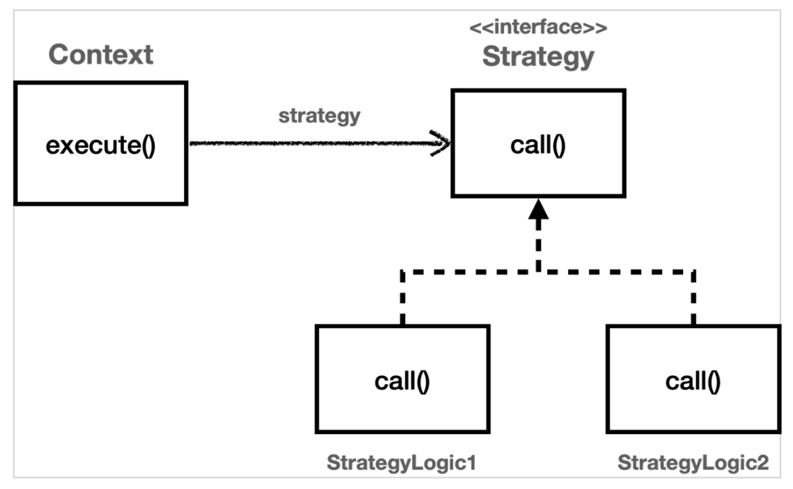
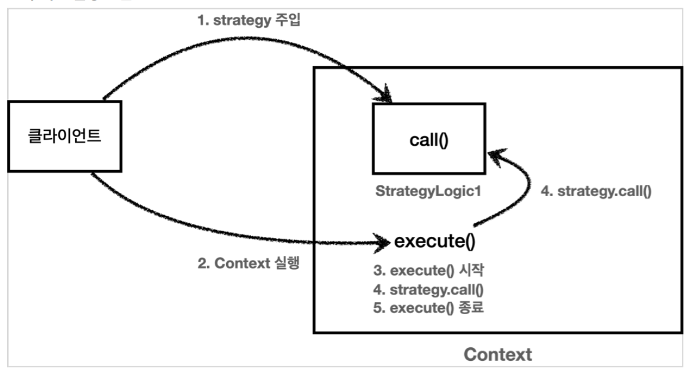

# 1. 전략패턴
 -> 탬플릿 메서드 패턴은 부모 클래스에 변하지 않는 템플릿을 두고, 변하는 부분을 자식 클래스에 두어서 상속을 사용해서 문제를 해결함.
전략 패턴은 변하지 않는 부분을 "Context"라는 곳에 두고, 변하는 부분을 Strategy라는 인터페이스를 만들어 해당 인터페이스를 구현하도록 하여
문제를 해결한다. 상속이 아니라 위임으로 문제를 해결하는 방식이다.

전략 패턴에서 Contxt는 변하지 않는 템플릿 역할을 하고, Stratey는 변하는 알고리즘 역할을 한다.

# 2. 개요
<br>
<p></p>
GOF 디자인 패턴에서 정의하는 전략패턴의 의도는 다음과 같다

```text
알고리즘 제품군을 정의하고 각각을 캡슐화하여 상호 교환 가능하게 만들자.
전략을 사용하면 알고리즘을 사용하는 클라이언트와 독립적으로 알고리즘을 변경할 수 있다.
```

# 3. 코드 참고
-> test/strategy/code 패키지내 테스트 코드를 기반으로 함.

# 4. 코드 설명
ContextV1은 변하지 안흔 로직을 가지고 있는 템플릿 역할을 하는 코드이다. 전략 패턴에서는 이것을 Context(문맥)이라 한다.
쉽게 이야기해서 Context(문맥)는 크게 변하지 않지만 그 문맥속에서 Strategy(전략)을 통해 일부 내용이 변경된다는 생각하면 편하다.

Context는 내부에 Strategy strategy 필드를 가지고 있다. 이 필드에 변하는 부분인 Stratey의 구현체를 주입하면 된다.
전략 패턴의 핵심은 Context는 Strategy 인터페이스에만 의존한다는 점이다. 덕분에 Strategy의 구현체를 변경하거나 새로 만들어도
Context코드에는 영향을 주지 않는다.

-> 스프링에서 의존관계 주입에서 사용하는 방식이다.

## 4.1 전략패턴 실행 그림

<br>

1. Context에 원하는 Strategy 구현체를 주입한다.<br>
2. 클라이언트는 context를 실행한다.<br>
3. context는 context로직을 시작한다.<br>
4. context로직 중간에 strategy.call()을 호출해서 주입받은 strategy로직을 실행한다.<br>
5. context는 나머지 로직을 실행한다.<br>


# 5.정리
-> 선 조립, 후 실행
Context의 내부 필드에 Strategy를 주입하고 사용하는 부분을 잘 보자
이 방식은 Context와 Strategy를 실행 전에 원하는 모양으로 조립해두고, 그 다음에 Context를 실행하는 선 조립, 후 실행 방식에서 매우 유용하다.
Context와 Strategy 를 한번 조립하고 하념 이후로는 Context를 실행하기만 하면 된다.

우리가 스프링으로 애플리케이션을 개발 할 때 애플리케이션 로딩 시점에서 의존관계 주입을 통해 필요한 의존관계를 모두 맺어두고 난 다음에
실제 요청을 처리하는 것과 같은 원리다.

# 6. 단점
Context와 Strategy를 조립한 이후에는 전략을 변경하기가 번거롭다.
Context에 setter를 제공하여 변경하는 방법도 있긴 하지만 Context를 싱글톤으로 사용할 땐 동시성 이슈등 고려할 사항이 많다.
그래서 전략을 실시간으로 변경해야 한다면 차라리 Context를 하나 더 생성하고 그곳에 다른 Strategy를 주입하는 것이 더 나은 
선택일 수 있다.