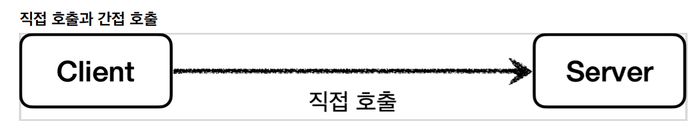
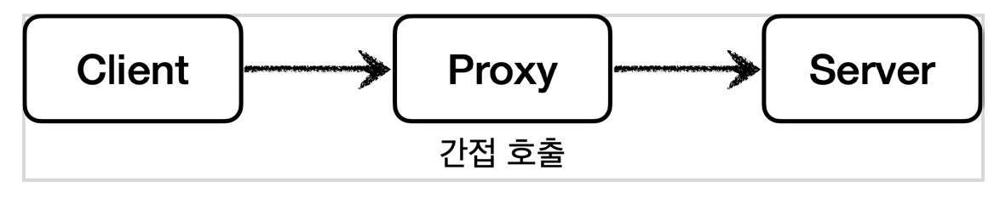
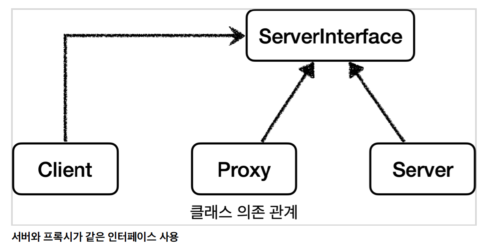
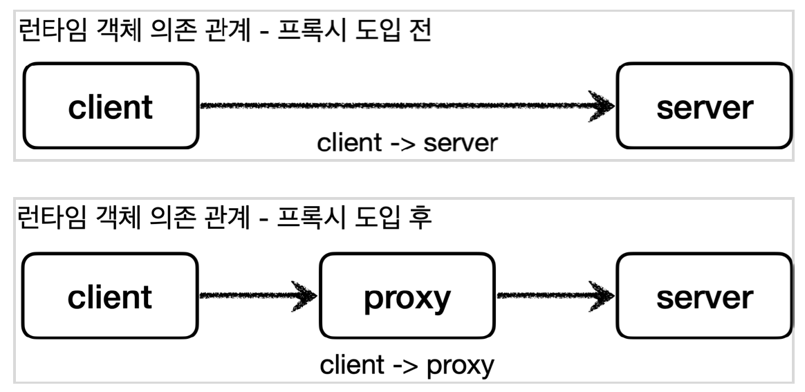

 # 1. 프록시란?
 일종의 대리자라고 생각하면 편함.
## 1.1 직접 호출

클라이언트가 서버에게 직접적으로 무얼 해달라고 요구하는경우.

## 1.2 간접호출

클라이언트가 요청하긴 하는데 서버에다가 하는게 아니라 누구에게 대리를 맡길수도 있다.
그 대리를 맡기는 대리자를 Proxy라고 한다.

# 2. 특징
재밌는 점은 직접 호출과는 다르게 간접호출시 대리자가 중간에 여러가지 일을 할 수 있다.
1. 동생에게 편의점 가는 길에 라면점 사와달라고 부탁을 했는데 집에 이미 라면이 있다고 한다. -> 기대보다 라면을 더 빨리 먹을 수 있다.( 접근제어, 캐싱)
2. 동생에게 치킨좀 사와달라고 부탁했는데 치킨뿐 아니라 맥주랑 콜라도 사왔다. 클라이언트가 기대한건 치킨뿐인데 맥주와 콜라라는 부가 기능도 얻게 되었다.(부가기능 추가)
3. 그리고 또 대리자가 또 다른 대리자를 부를 수 있다. 내가 동생에게 라면을 사달라고 부탁했는데 그 동생은 동생의 친구에게 라면좀 사와달라고 요청을 할 수 있다.
중요한 점은 클라이언트는 대리자를 통해 요청했기 때문에 그 이후 과정은 모른다는 점이다. 동생을 통해서 라면이 나에게 도착하기만 하면 된다.(프록시체인)

# 3. 조건
아무 객체나 프록시가 될 수 있는건 아니다.
객체에서 프록시가 되렴녀 클라이언트는 서버에게 요청을 한 것인지, 프록시에게 요청을 한 것인지 조차 몰라야 한다.
쉽게 이야기하여 서버와 프록시는 같은 인터페이스를 사용해야 한다. 그리고 클라이언트가 사용하는 서버 객체를 프록시 객체로 변경해도 클라이언트 코드를 변경하지 않고 동작할 수 있어야 한다.

클래스 의존관계를 보면 클라이언트는 서버 인터페이스에만 의존한다. 그리고 서버와 프록시가 같은 인터페이스를 사용한다. 따라서 DI를 사용해서 대체 가능하다.

이번에는 런타임 객체 의존 관계를 살펴보자. 런타임에 클라이언트 객체에 DI를 사용해서 Client -> Server에서 Client -> Proxy로 객체 의존관계를 
변경해도 클라이언트 코드를 전혀 변경하지 않아도 된다. 클라이언트 입장에서는 변경 사실조차 모른다.
Di를 사용하면 클라이언트 코드의 변경 없이 유연하게 프록시를 주입할 수 있다.

# 4. 프록시의 주요기능
* 접근제어
  * 권한에 따른 접근 차단
  * 캐싱
  * 지연로딩(JPA)
* 부가기능 추가
  * 원래 서버가 제옥하는 기능에 더해서 부가 기능을 수행한다.
  * 예) 요청 값이나, 응답 값을 중간에 변형한다.
  * 예) 실행 시간을 측정해서 추가 로그를 남간디ㅏ.

프록시 객체가 중간에 있으면 크게 접근 제어와 부가 기능 추가를 수행할 수 있다ㅣ.

# 5. GOF 디자인패턴
접근제어와 부가기능추가 둘 다 프록시를 사용하는 방법이지만 GoF 디자인 패턴에서는 이 둘을 의도에 따라서
프록시패턴과 데코레이터패턴으로 구분한다.
* 프록시패턴 : 젭근 제어가 목적
* 데코레이터 패턴 : 새로운 기능 추가가 목적

둘 다 프록시를 사용하지만 의도가 다르다는 점이 핵심이다.  용어가 프록시 패턴이라고 해서 이 패턴만 프록시를 사용하는것은 아니다.
데코레이터 패턴도 프록시를 사용한다.