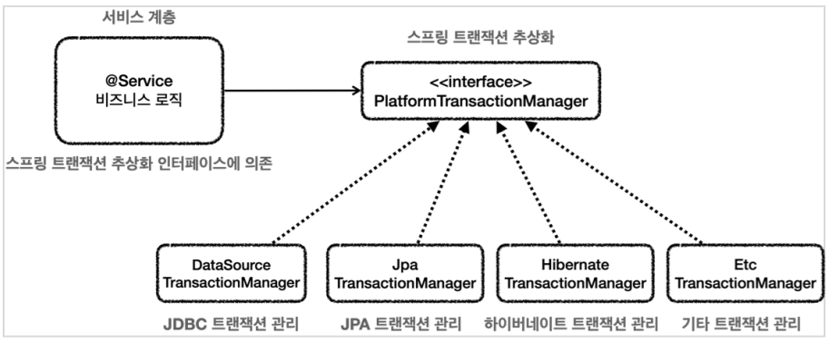

# 1. 순수한 서비스 계층

* 서비스 계층 : 핵심 비즈니스 로직이 들어있는 서비스 계층이다.
시간이 흘러서 ui와 관련한 부분이 변하고 데이터 저장 기술이 다른 기술로 변하더라도 비즈니스 로직은 최대한 변경없이 유지되어야 한다.
-> 이렇게 하려면 종속적이지 않은 서비스계층이 필요하다.

* 계층을 나눈 이유도 서비스계층이 최대한 순수하게 유지되게 하기 위한 목적이 크다.기술에 종속적인 부분은 프레젠테이션 계층, 데이터 접근계층에서 가지고 간다.
* 프레젠테이션 계층(@Controller)은 클라이언트가 접근하는 UI와 관련된 기술인 웹, 서블릿 HTTP완 관련한 기술을 담당함.
예를 들어 HTTP API를 사용하다가 GRPC같은 기술로 변경해도 프레젠테이션 코드만 변경하고 서비스 계층은 변경하지 않아도 된다.

* 데이터 접근 계층은 데이터를 저장하고 관리하는 기술을 담당한다. 그래서 JDBC, JPA와 같은 구체적인 데이터 접근 기술로 부터 서비스 계층을 보호혼다.
* 예를들어 JDBC를 사용하다 JPA로 변경해도 서비스 계층은 변경하지 않아도 된다. 접근계층을 직접 접근하는것 보단 인터페이스를 제공하고 서비스 계층은 이 인터페이스에 의존하는게 좋다.
그래야 서비스 코드의 변경없이 JDBCRepository를 JpaRepository로 변경할 수 있다.
* 정리하자면 서비스계층은 가급적 비즈니스 로직만 구현하고 특정 구현 기술에 직접 의존하면 안된다. 이렇게 하면 향후 구현 기술이 변경될 때 변경의 영향 범위를 최소화 할 수 있다.


# 2. 문제점들
```java
// MemeberServiceV1의 문제점 파악
    package hello.jdbc.service;
    import java.sql.SQLException;
    @RequiredArgsConstructor
    public class MemberServiceV1 { 
        private final MemberRepositoryV1 memberRepository;
        public void accountTransfer(String fromId, String toId, int money) throws SQLException {
             Member fromMember = memberRepository.findById(fromId);
             Member toMember = memberRepository.findById(toId);
             memberRepository.update(fromId, fromMember.getMoney() - money);
             memberRepository.update(toId, toMember.getMoney() + money);
        }
    }
```
* 잘된 점 => 특정 기술에 종속적이지 않고 순수한 비즈니스 로직만 존재한다.
* 향후 비즈니스 로직의 변경이 필요하다면 여기만 바꾸면 된다.

* 바꿔야 할 점. => SqlException은 JDBC 기술에 의존한다.
* 이 부분은 memberRepository에서 올라오은 예외이기 때문에 memberRepository에서 해결해야 한다.
* MemberRepositoryV1이라는 구체 클래스에 직접 의존하고 있다. MemberRepository 인터페이스를 도입하면 향후 MemberService의 코드의 변경 없이 다른 구현 기술로 변경이 가능하다.

```java
//MemberServiceV2의 문제점 파악
    package hello.jdbc.service;
    import javax.sql.DataSource;
    import java.sql.Connection;
    import java.sql.SQLException;
    @Slf4j
    @RequiredArgsConstructor
    public class MemberServiceV2 {
     private final DataSource dataSource;
     private final MemberRepositoryV2 memberRepository;
     public void accountTransfer(String fromId, String toId, int money) throws SQLException {
         Connection con = dataSource.getConnection();
         try {
             con.setAutoCommit(false); //트랜잭션 시작
             //비즈니스 로직
             bizLogic(con, fromId, toId, money);
             con.commit(); //성공시 커밋
         } catch (Exception e) {
             con.rollback(); //실패시 롤백
             throw new IllegalStateException(e);
         } finally {
            release(con);
         }
     }
    private void bizLogic(Connection con, String fromId, String toId, int money) throws SQLException {
         Member fromMember = memberRepository.findById(con, fromId);
         Member toMember = memberRepository.findById(con, toId);
         memberRepository.update(con, fromId, fromMember.getMoney() - money);
         memberRepository.update(con, toId, toMember.getMoney() + money);
    }
}
```
* 트랜잭션은 비즈니스 로직이 있는 서비스 계층에서 시작하는게 좋다.
* 문제는 트랜잭션을 사용하기 위해서 'java.sql.DataSource', 'java.sql.Connection', 'java.sql.SQLException' 같은 JDBC기술에 의존해야 한다.
* 트랜잭션을 사용하기 위해서 JDBC 기술에 의존한다 -> 결과적으로 비즈니스 로직보다는 JDBC를 사용해서 트랜잭션을 처리하는 코드가 더 많다.
* 향후 JDBC에서 JPA와 같은 기술로 바꾸게 되면 서비스 코드도 모두 함께 변경해야 한다.(JPA는 트랜잭션을 사용하는 코드가 JDBC와는 다르다.)
* 핵심 비즈니스 로직과 JDBC 기술이 섞여있어 유지보수가 어렵다.


# 3. 문제의 해결. 트랜잭션의 추상화.
* 사실 단순하게 생각하면 아래와 같이 인터페이스를 만들어 사용하면 트랜잭션 문제는 끝이난다.
```java
    public interface TxManager {
        begin();
        commit();
        rollback();
    }
```
* 간단하게 트랜잭션을 시작하고, 비즈니스 로직의 수행이 끝나면 커밋하거나 롤백하면 된다.



* 서비스는 특정 트랜잭션 기술에 직접 의존하는게 아니라 TxManager라는 추상화된 인터페이스에 의존한다. 이제 원하는 구현체를 DI를 통해서 주입하면 된다.
* 클라이언트 서비스는 인터페이스에 의존하고 DI를 사용한 덕분에  OCP 원칙을 지키게 되었다. 


# 4. 트랜잭션 동기화
-> 스프링이 제공하는 트랜잭션 매니저는 크게 2가지 역할을 한다.
* 트랜잭션 추상화
* 리소스 동기화

## 4.1 리소스 동기화
트랜잭션을 유지하려면 트랜잭션의 시작부터 끝까지 같은 데이터베이스 커넥션을 유지해야 한다. 결국 같은 커넥션을 동기화하기 위해서는 이전에는 파라미터로 커넥션을 전달하는 방법을 사용했다.
파라미터로 커넥션을 전달하는 방법은 코드가 지저분해지는 것은 물론이고, 커넥션을 넘기는 메서드와 넘기지 않는 메서드를 중복해서 만들어야 하는 등 여러 단점이 존재한다.

## 4.2 스프링의 해결방법
* 스프링은 트랜잭션 동기화 매니저를 제공한다. 이것은 쓰레드 로컬을 사용하여 커넥션을 동기화 해준다. 트랜잭션 매니저는 내부에서 이 트랜잭션 동기화 매니저를 사용한다.
* 트랜잭션 동기화 매니저는 쓰레드 로컬을 사용하기 때문에 멀티쓰레드 상황에 안전하게 커넥션을 동기화 할 수 있다. 따라서 커넥션이 필요하면 트랜잭션 동기화 매니저를 통해 커넥션을 획득하면 된다.
* 따라서 이전처럼 파라미터로 커넥션을 전달하지 않아도 된다.

## 4.3 동작방식
1. 트랜잭션을 시작하려면 커넥션이 필요함. 트랜잭션 매니저는 데이터소스를 통해 커넥션을 만들고 트랜잭션을 시작한다.
2. 트랜잭션 매니저는 트랜잭션이 시작된 커넥션을 트랜잭션 동기화 매니저에 보관한다.
3. 레포지토리는 트랜잭션 동기화 매니저에 보관된 커넥션을 꺼내서 사용한다. 따라서 파라미터로 커넥션을 전달하지 않아도 된다.
4. 트랜잭션이 종료되면 트랜잭션 매니저는 트랜잭션 동기화 매니저에 보관된 커넥션을 통해 트랜잭션을 종료하고 커넥션도 닫는다. 