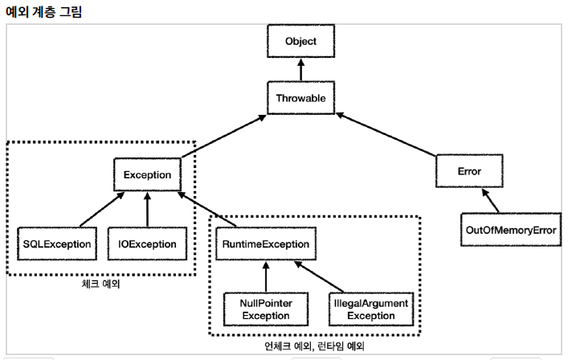

# 1. 예외계층



## 1.1 예외의 기본규칙
* 예외는 폭탄돌리기와 같다. 해당 레이어에서 처리할 수 있다면 처리하고 처리할 수 없다면 밖으로 던져야한다.
* 예외에 대해서는 두가지 기본 규칙을 잘 지키자
* 1. 예외는 잡아서 처리하거나 던져야 한다.
  2. 예외를 잡거나 던질 때 지정한 예외뿐만 아니라 그 예외의 자식들도 함께 처리한다
  * ex) Exception을 catch로 잡으면 그 하위 예외들도 모두 잡을수 있다.
  * ex2) Exception을 throw로 던지면 그 하위 예외들도 모두 던질수 있다.

* 참고 예외를 처리하지 못하고 계속 앞으로 던지면
  * 자바의 경우엔 예외 로그를 출력하고 시스템이 종료됨
  * 웹어플리케이션의 경우 사용자의 요청을 처리하기 위해 was가 해당 예외를 받아서 처리하는데
  주로 사용자에게 개발자가 지정한 오류페이지를 보여준다.

# 2. 체크 예외 기본 이해
* RuntimeException을 제외하고 Exception과 그 하위 예외는 모두 컴파일러가 체크하는 체크예외임.
* 체크예외는 잡아서 처리하거나 또는 밖으로 던지라고(throw Exception) 직접 선언을 해줘야함
* 그렇지 않으면 컴파일 오류가 발생한다.

## 2.2 Exception을 상속받으면 체크예외가 된다.
* RuntimeException을 상속받으면 언체크 예외가 된다.
* 자바 문법에서 정한거다.


# 3. 언체크 예외 기본 이해
* RuntimeException과 그 하위 예외는 모드 언체크 예외다.
* 언체크 예외란 말 그대로 컴파일러가 체크를 하지 않는다.
* 언체크 예외는 체크 예외와 기본적으로 동일하다. 차이가 있다면 throw를 생략해도 된다. 생략하면 자동으로 예외를 던진다.

체크 : try~catch로 잡는게 아니면 throw 명시하여 던져야 함</br>
언체크 : 예외를 잡아서 처리 안해도 thow 생략 가능.

# 4. 체크예외의 활용
-> 언제 체크예외를 사용하고 언제 언체크를 사용해야 할까?

* 기본적으로는 언체크(런타임)에러를 사용하자
* 체크 예외는 비즈니스 로직상 너무 중요해서 의도적으로 던지는 예외만 사용하자
  * 계좌이체 실패나 결제시 포인트 부족, 로그인 id, pw 불일치 등
* 무조건 중요하다고 체크예외로 만들 필요는 없지만 개발자가 실수로 예외를 놓치면 안되는 경우라고 판단 된다면 체크 예외로 만들어 두어 놓친 예외를 인지할 수 있다.


# 4.1 체크 예외의 문제점
* 그냥 귀찮은데 전부 throw 해버리죠? -> 안된다.
* 모든 exception들을 throw하게 되면 throw 해야할 exception 종류가 많아질 경우 코드가 지저분 해질뿐만 아니라
* 데이터베이스 에러의 같이 컨트롤러나 서비스에서는 처리할 수 없는 에러의 경우엔 에러를 던져도 처리가 방법이 없어서 밖으로 던질수 밖에 없다.
* 또 의존관계에 대한 문제도 있다
* SQLException의 경우 JDBC 기술이다. 기껀 컨트롤러 서비스 레파지토리로 객체지향적으로 잘 분리 다 해놨는데 컨트롤러나 서비스가 jdbc 기술에 의존해버리면
* 나중에 레파지토리단 기술을 바꾸게 되면 이 예외들도 전부 바꿔줘야 한다. -> 의존하지 않아야 할 것에 의존해버리는 문제가 생기게 된다.


# 5. 결론
*  체크 예외의 경우 잡아서 RuntimeError를 상속받은 다른 언체크예외로 바꾸어 던지게 하자.
```java
static class Repository{

        public void call()  {
            try {
                runSql();
            } catch (SQLException e) {
                throw new RuntimeSqlException(e);
            }
        }
        public void runSql() throws SQLException {
            throw new SQLException("ex");
        }
    }
```
* 참고로 exception 치환시에는 이전의 에러를 꼭 파라미터로 넘겨주어야 에러의 이력추적이 가능해진다.
* 안넣어주면 그냥 빈값으로 나와서 에러를 고칠수가 없다.


```java
static class RuntimeSqlException extends RuntimeException{
        public RuntimeSqlException(Throwable cause) {
            super(cause);
        }
    }
```
* Throwable cause를 사용하면 문제의 원인을 다 출력해주니 message만 쓰지 말고 cause도 잘 활용하면 좋다.ㅊ
*  참고 -> UnCheckedAppTest
