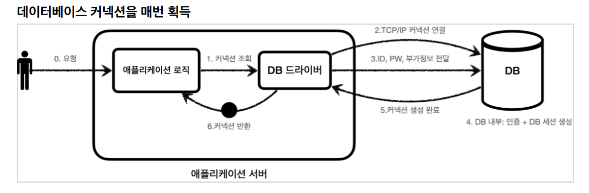
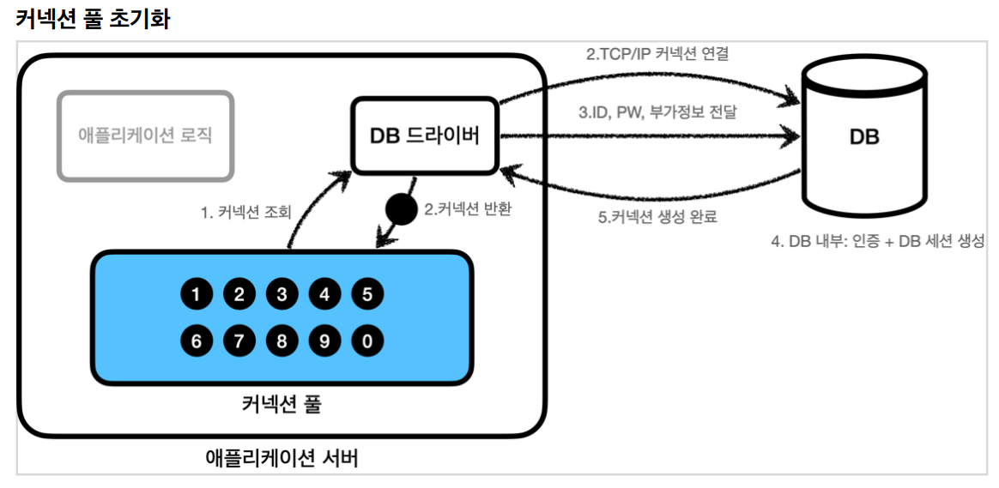
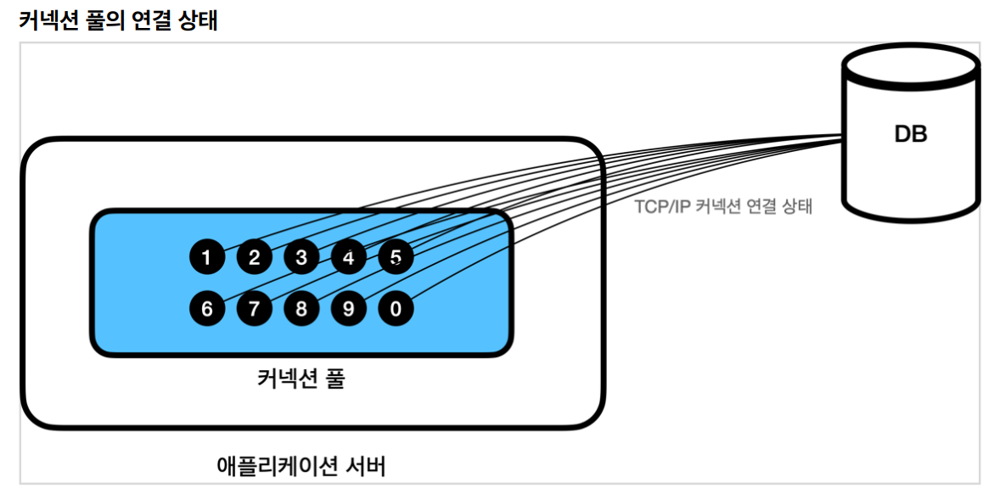
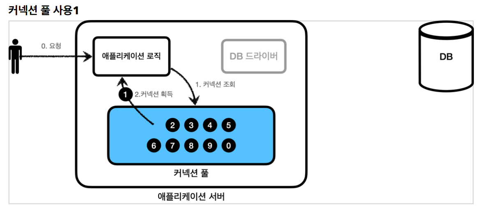
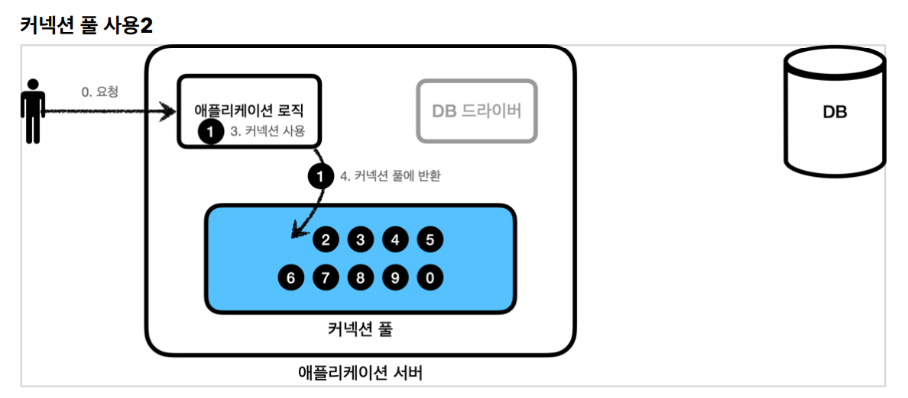
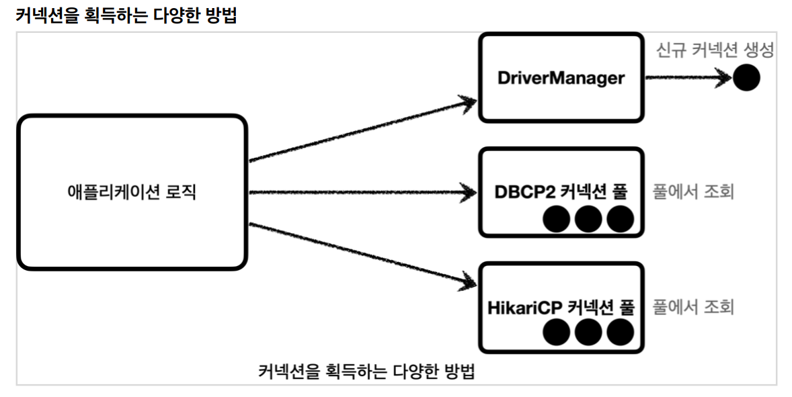
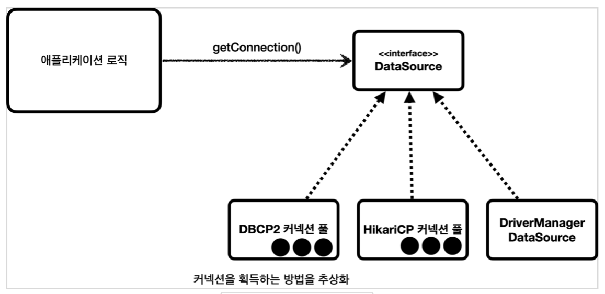

# 1. 커넥션풀의 이해
## 1.1 커넥션  획득 과정


1. 애플리케이션 로직은 DB드라이버를 통해 커넥션을 조회한다.
2. DB 드라이버는 DB와 TCP/IP연 커넥션 연결한다. -> 3 way handShake와 같은 네트워크 연결 동작이 발생함.
3. DB 드라이버는 TCP/IP 커넥션이 연결되면 ID, PW와 기타 부가정보를 DB에 전달한다.
4. DB는 부가정보들로 인증을 완료하고 내부에 DB세션을 생성한다.
5. DB는 커넥션 생성이 완료되었다는 응담을 보내고 DB드라이버는 커넥션 객체를 생성해서 클라이언트에 반환한다.

-> 이렇게 커넥션을 새로 만드는 것은 과정도 복잡하고 시간도 많이 소모된다. DB는 물론이고 TCP/IP 커넥션을 새로 생성하기 위한
리소스를 배번 사용해야 한다. 진짜 문제는 고객이 애플리케이션을 사용할 때, SQL을 실행하는 시간 뿐만 아니라 커넥션을 새로 만드는 시간이
추가되기 때문에 결과적으로 응답 속도에 영향을 준다.


## 1.2 커넥션 풀

이런 문제를 한번에 해결하는 아이디어가 바로 커넥션을 미리 생성해두고 사용하는 커넥션 풀이라는 방법이다.



* 이름 그대로 커넥션을 관리하는 수영장과 같다고 보면 된다.

* 애플리케이션을 시작하는 시점에 커넥션 풀은 필요한 만큼 커넥션을 미리 확보해서 풀에 보관한다. 
보통 얼마나 보관할 지는 서비스의 특징과 서버 스펙에 따라 다르지만 기본값은 보통 10개이다.

## 1.3 커넥션 풀의 연결상태



커넥션 풀에 들어있는 커넥션은 TCP/IP로 DB와 커넥션이 연결되어 있는 상태이기 때문에 언제든지 즉시 SQL을 DB로 전달이 가능하다.

## 1.4 커넥션 풀의 사용1


* 애플리케이션 로직에서 이제는 DB드라이버를 통해서 새로운 커넥션을 획득하는게 아니다.
* 이제는 커넥션 푸을 통해 이미 생성되어 있는 커넥션을 "객체 참조"로 "그냥 가져다 쓰면 된다".
* 커넥션 풀에 커넥션을 요청하면 커넥션 풀은 자신이 가지고 있는 커넥션 중에 하느를 반환한다.

## 1.5 커넥션 풀의 사용2


* 애플리케이션 로직은 커넥션 풀에서 받은 커넥션을 사용해서 SQL을 데이터베이스에 전달하고 그 결과를 받아서 처리한다.
* 커넥션을 모두 사용하고 나면 이제는 커넥션을 종료하는게 아니라 다음에 다시 사용할 수 있게 해당 커넥션을
그대로 커넥션 풀에 반환한다. 여기서 주의할 점은 커넥션을 종료하는게 아니라 "커넥션이 살아있는 상태"로 커넥션 풀에 반환한다.

## 1.6 정리
* 적절한 커넥션 풀 숫자는 서비스의 특징과 애플리케이션 서버스팩, DB 서버 스팩에 따라 다르기 때문에 성능 테스트를 통해서 정해야함
* 커넥션 풀은 서버당 최대 커넥션 수를 제한할 수 있다. -> DB에 무한정 연결이 생성되는것을 막아주어 DB를 보호하는 효과도 있다.
* 커넥션풀은 실무에선 기본
* 커넥션 풀은 개념적으로 단순해서 직접 구현도 가능 -> 근데 그냥 오픈소스 쓰자 
* commons-dbcp2, tomcap-jdbc pool, HikariCP가 대표적
* 스프링부트 2.0부터는 기본 커넥션 풀로 HikariCP를 제공함.


# 2. DataSource 이해
커넥션 풀을 사용하는 다양한 방법.



* 커넥션 풀을 얻는 방법은 다양함. JDBC DriverManager를 직접 사용하거나 커넥션 풀을 사용하는 등 다양한 방법이 존재.
* if  JDBC로 개발한 애플리케이션 처럼 DriverManager를 통해서 커넥션을 획득하다가 커넥션 풀을 사용하는 방법으로 변경하려면 어떻게 해야함?
* DriverManager를 사용해서 커넥션을 획득하다가 HikariCp같은 커넥션 풀을 사용하도록 변경시 커넥션을 획득하는 "애플리케이션 코드도 변경"해야 함
의존관계가 DriverManager -> HikariCp로 변경되기 때문임


## 2.1 커넥션을 획득하는 방법을 추상화



* 자바에선 이런 문제를 해결하기 위해 javax.sql.DataSoruce라는 인터페이스를 제공함.
* DataSource는 커넥션을 획들하는 방법을 추상화 하는 인터페이스다.
* 이 인터페이스의 핵심 기능은 커넥션 조회 하나다.

## 2.2 정리
* 대부분의 커넥션 풀은 DataSource 인터페이스를 이미 구현해둠. -> 개발자는 직접 HikariCp에 의존하는게 아니라 DataSource 인터페이스에만
의존하도록 애플리케이션 로직을 작성하면 된다.
* DriverManager는 DataSource인터페이스를 사용하지 않는다. -> DriverManager는 직접 사용해야 함.
* DriverManager를 사용하다 DataSource 기반의 커넥션 풀을 사용하도록 변경하면 관련 코드를 모두 수정해야 함.
* 이런 문제 해결을 위해 스프링은 DriverManager도 DataSoruce를 동해 사용 가능하다록 DriverManagerDataSource라는 DataSoruce를 구현한 클래스를 제공함
* 자바는 DataSource를 통해 커넥션을 획득하는 방법을 추상화함. 애플리케이션 로직은 DataSource 인터페이스에만 의존하면됨. 
-> DriverManagerDataSource를 통해서 DriverManager를 사용하다가 커넥션 풀을 사용하도록 코드를 변경해도 애플리케이션 로직은 변경하지 않아도 된다.


## 2.3 ConnectionTest.java 소스 설명
참고 -> test/hello/jdbc/connection/ConnectionTest.java

### 2.3.1 DriverManager와 DriverManagerDataSource 차이점
* driverManager와 DriverManagerDataSource에는 큰 차이점이 있다
* DriveManager : 새로운 커넥션을 획득할 때 마다 URL, 유저네임, 패스워드를 파라미터로 계속 넘겨야 함
* DriverManagerDataSource : 최초 객체 생성시 한번만 파라미터로 URL, 유저네임, 패스워드로 전달. 그 이후 커넥션 획득시엔 getConnection만 호출하면 됨.

     설정과 사용의 분리
     -> 설정 : DataSource를 만들고 필요한 속성들을 사용해서 URL, USERNAME, PASSWORD 같은 부분을 입력하는 것을 말함.
     이렇게 설정과 관련된 속성들은 한곳에 있는것이 향후 변경에 더 유연하게 대처할 수 있다.
      사용 : 설정은 신경쓰지 않고 DataSource, getConnection()만 호출해서 사용하면 된다.

     쉽게이야기 해서 Repository는 DataSource만 의존 -> 이런 속성들은 몰라도 된다.


### 2.3.2  쓰레드를 사용하여 커넥션풀에 커넥션을 채우는 이유
* 커넥션 풀에 커낵션을 채우는 일은 상대적으로 오래 걸리는 일이다.
* 애플리케이션을 실행할 때 커넥션 풀을 채울 때 까지 마냥 대기하고 있다면 애플리케이션 실행 시간이 늦어진다.
-> 별도의 쓰레드를 사요하여 커넥션 풀을 채워야 애플리케이션 실행 시간에 영향을 주지 않는다.

## 2.4 MemberRepositoryV1Test 소스 설명
참고 -> test/hello/jdbc/repository/MemberRepositoryV1Test.java

```java
   @Slf4j
class MemberRepositoryV1Test {

    MemberRepositoryV1 repository;

    @BeforeEach
    void beforeEach(){
        // 기본 DriverManager - 항상 새로운 커넥션을 획득
        //DriverManagerDataSource dataSource = new DriverManagerDataSource(URL, USERNAME, PASSWORD);

        //커넥션 풀링
        HikariDataSource dataSource = new HikariDataSource();
        dataSource.setJdbcUrl(URL);
        dataSource.setUsername(USERNAME);
        dataSource.setPassword(PASSWORD);

        repository = new MemberRepositoryV1(dataSource);// <- 의존관계 주입시 HikariDataSource의 부모타입이 DataSource라서 그대로 넣어도 받을 수 있음.
    }

    @Test
    void crud() throws SQLException {
        //save
        Member member = new Member("memberV0", 10000);
        repository.save(member);

        //findById
        Member findMember = repository.findById(member.getMemberId());
        log.info("findMember={}", findMember);
        assertThat(findMember).isEqualTo(member);

        //update: money: 10000 -> 20000
        repository.update(member.getMemberId(), 20000);
        Member updatedMember = repository.findById(member.getMemberId());
        assertThat(updatedMember.getMoney()).isEqualTo(20000);
        //delete
        repository.delete(member.getMemberId());
        assertThatThrownBy(() -> repository.findById(member.getMemberId()))
                .isInstanceOf(NoSuchElementException.class);

        try{
            Thread.sleep(1000);
        }catch (Exception e){
            e.printStackTrace();
        }

       
    }

}
    
```

### 2.4.1 crud() 설명
* curd()의 로그를 잘보면 conn0만 사용을 했다는걸 확인이 가능
* conn0을 쓰고 없애는게 아니라 conn0을 다 쓰면 다시 반환하고 메서드 끝나면 다시 첫번째인 conn0을 갖다 쓰고 그래서 0번만 찍힌거임
  맨 첫번째에 있는 커넥션풀을 가져다가 씀. 지금은 그런데 나중에 동시에 여러 커넥션들을 쓰게되면 conn1, conn2도 쓰인다.